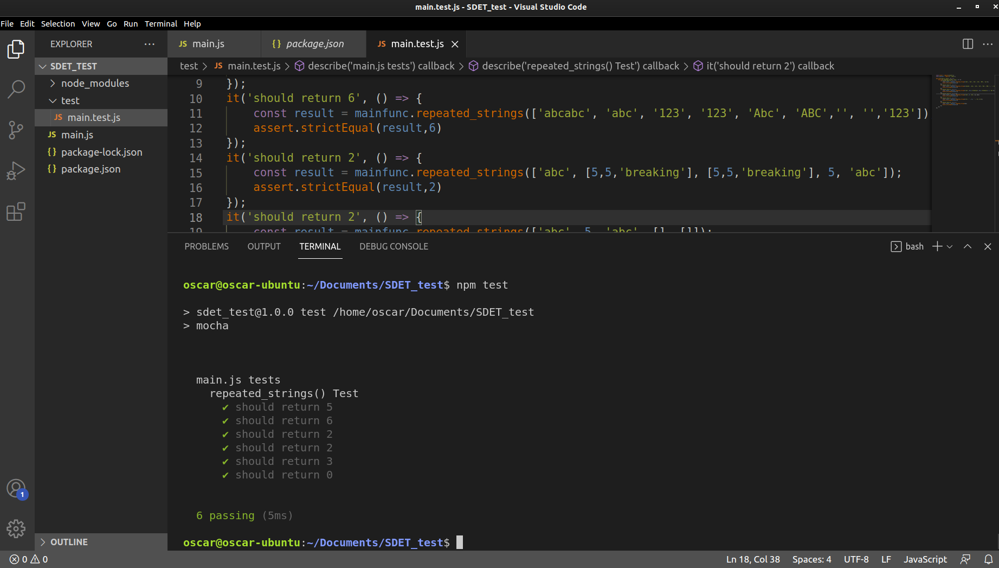

# JSFunction_UnitTest
## Table of Contents
* Task
* How to Run
* Solution
* How to Run
* Test Cases

## Task

1. Write a javascript (ES6) function that takes a single argument of an array of strings, 
and returns the total number of repeated strings. For instance, given the input 
['abc', '123', '123', 'Abc', 'xyz'] the function would return the number 4 
(2 instances of 'abc' (case-insensitive) plus 2 instances of '123'). The function should 
always return a number and not throw an exception or crash.

2. Write unit tests for the function to make sure it works. Cover all the equivalence 
partitions and error conditions you can think of.

## How to Run

* Download through git or zip file
* Open SDET_TEST through VScode
* enter "npm install" inside terminal (this initializes the project and downloads dependencies)
* enter "npm test" inside terminal (this runs the test cases from /test/main.test.js for the function inside /main.js)

## Solution

### Function from main.js

    const repeated_strings = array => {
      var array_check = []
      var array_check_multiple = []
      var counter = 0

      //Check to see if array includes anything other than a string in element
      //If so remove them
      for(var i = 0; i < array.length; i++){
          if(typeof array[i] != "string"){
              array.splice(i,1);
              i--
          }
      }

      //After non string elements removed then convert all to lowercase
      var array = array.map(array => array.toLowerCase());

      //Loops through to count number of repeated strings
      for(var i = 0; i < array.length; i++){
          if ((array[i] == null) || (array[i].trim().length == 0)){
          }
          else if(array_check.includes(array[i]) && !array_check_multiple.includes(array[i])){
              counter = counter + 2
              array_check_multiple.push(array[i])
          } else if(array_check.includes(array[i]) && array_check_multiple.includes(array[i])) {
              counter = counter + 1
              array_check_multiple.push(array[i])
          } else {
          array_check.push(array[i])
          }
      }
      return counter;
    }
    
    
## Test Cases

### Valid Zone:
input can be within valid zone which is a string in each element eg. ['test','test','imastring','gohawks']

### Invalid Zone:

Input can be within invalid zone which is a string in an element and a number in another eg. ['test',5]
* For this I removed 5 from the array and looped through the new constructed array to check if there are any matches

Input can be within invalid zone which is a string in an element and an array filled with anything in another 
eg. ['abc', [5,5,'breaking'], [5,5,'breaking']]
* For this I removed the arrays within the array and looped through the new constructed array to check if there any matches

Input can be within invalid zone by a mix of numbers and arrays eg. ['abc', 6, [5,5,'breaking'], [5,5,'breaking'], 4]
* For this I removed the arrays within the array and the numbers then looped through the new constructed array to check if there any matches of strings

### Can be Valid or Invalid Zone:

Input can be a string with white space or empty string with no whitespace eg. ['','',' ',' ']
* For this I chose to not allow matches of empty or whitepace strings this would return 0

input can be completely empty array eg. []
* For this I chose to return a 0
